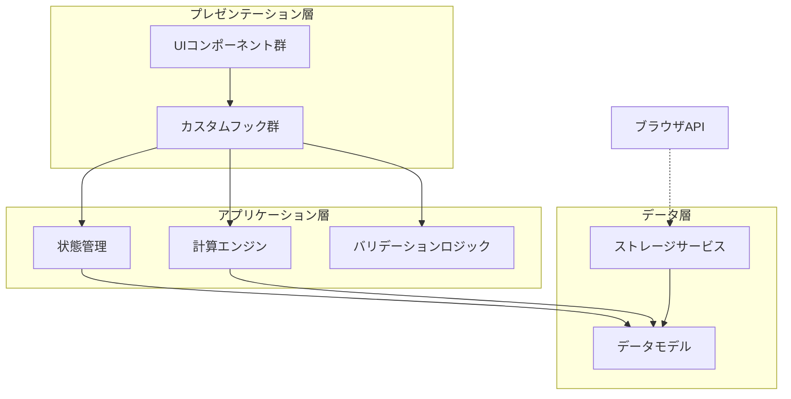
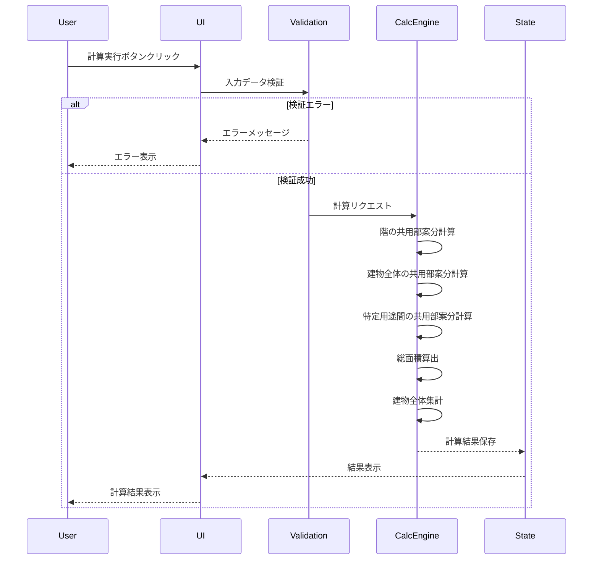
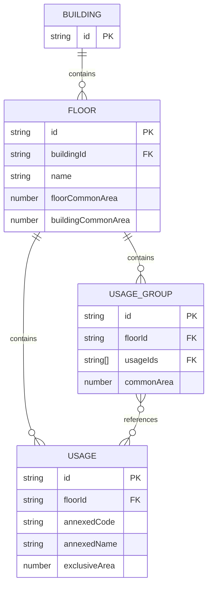

# 設計ドキュメント

## 概要

**目的**: 本機能は、消防法に基づく複合用途防火対象物の面積計算を支援するWebアプリケーションを提供し、消防設備設置基準判定業務を行う専門家に正確な面積算出機能を提供する。

**ユーザー**: 消防設備の設計・施工業者、建築設計者、消防署職員などが、複合用途建物の用途別面積を算出するために利用する。

**影響**: 従来の手動計算やスプレッドシートベースの作業を、専用Webアプリケーションによる効率的かつ正確な計算プロセスに置き換える。

### ゴール
- 階ごとの用途と3種類の共用部面積の入力・管理機能を提供
- 専用部分面積の比率に基づく共用部面積の自動案分計算を実現
- 階ごとおよび建物全体の集計結果を明確に表示
- レスポンシブで直感的なユーザーインターフェースを提供

### 非ゴール
- サーバーサイドでのデータ保存・管理（完全クライアントサイド）
- データの永続化機能（ローカルストレージ等）
- マルチユーザー協調編集機能
- 消防法規の自動判定機能（面積計算のみ）
- PDFレポート生成機能（将来検討）
- 他システムとのAPI連携

## アーキテクチャ

### アーキテクチャパターンと境界マップ



**アーキテクチャ統合**:
- **選択パターン**: レイヤードアーキテクチャ（プレゼンテーション/アプリケーション/データ）
  - 理由: 小規模Webアプリに最適、Reactのベストプラクティスに準拠
- **ドメイン/機能境界**: UIロジックとビジネスロジック（計算）を明確に分離
- **新規コンポーネントの根拠**: 
  - 計算エンジン: 複雑な案分ロジックを純粋関数として分離（テスト容易性）

### 技術スタック

| レイヤー | 選択/バージョン | 機能での役割 | 備考 |
|---------|----------------|------------|------|
| フロントエンド | React 18+ | UIコンポーネント構築 | Hooks API使用 |
| 型システム | TypeScript 5+ | 型安全性とデータ構造定義 | strict mode有効 |
| ビルドツール | Vite 5+ | 開発サーバーとビルド | 高速HMR |
| スタイリング | CSS Modules / Tailwind CSS | レスポンシブUI | 検討中 |
| 数値計算 | 標準JavaScript Number | 面積計算 | 精度要件次第でDecimal.js検討 |

## システムフロー

### 面積計算フロー



**フロー決定事項**:
- 検証は計算前に完全実施（フェイルファスト）
- 計算は3段階（階の共用部 → 建物全体 → 特定用途間）で順次実行
- エラー時は途中で中断し、エラー箇所を明示

## 要件トレーサビリティ

| 要件 | 概要 | コンポーネント | インターフェース | フロー |
|-----|------|-------------|--------------|-------|
| 1 | 階の管理 | FloorManager, FloorList | FloorManagementService | - |
| 2 | 構成用途の入力管理 | UsageForm, UsageList | UsageManagementService | - |
| 3 | 階の共用部面積入力 | FloorCommonAreaInput | FloorData | - |
| 4 | 建物全体の共用部面積入力（各階） | BuildingCommonAreaInput | FloorData | - |
| 5 | 特定用途間の共用部面積入力 | UsageGroupSelector, UsageGroupCommonAreaInput | UsageGroupService | - |
| 6 | 入力値の検証 | ValidationService | ValidationRules | - |
| 7 | 階の共用部面積の案分計算 | CalculationEngine | FloorCommonAreaCalculator | 面積計算フロー |
| 8 | 建物全体の共用部面積の案分計算 | CalculationEngine | BuildingCommonAreaCalculator | 面積計算フロー |
| 9 | 特定用途間の共用部面積の案分計算 | CalculationEngine | UsageGroupCommonAreaCalculator | 面積計算フロー |
| 10 | 総面積の算出 | CalculationEngine, ResultsDisplay | TotalAreaCalculator | 面積計算フロー |
| 11 | 建物全体の集計 | AggregationService, BuildingSummary | BuildingAggregator | - |
| 12 | 計算結果のクリアと再計算 | AppControls | StateManagementService | - |
| 13 | ユーザーインターフェース | 全UIコンポーネント | - | - |

## コンポーネントとインターフェース

### コンポーネント概要

| コンポーネント | ドメイン/レイヤー | 意図 | 要件カバレッジ | 主要依存関係 | 契約 |
|------------|----------------|------|-------------|------------|-----|
| CalculationEngine | アプリケーション | 全ての案分計算ロジックを実行 | 7, 8, 9, 10 | なし (P0) | Service |
| StateManagementService | アプリケーション | アプリケーション状態の管理 | 1, 2, 3, 4, 5, 12 | CalculationEngine (P0) | Service, State |
| ValidationService | アプリケーション | 入力データの検証 | 6 | なし (P0) | Service |
| FloorManager | プレゼンテーション | 階の追加・削除・編集UI | 1 | StateManagementService (P0) | State |
| UsageManager | プレゼンテーション | 用途の追加・削除・編集UI | 2 | StateManagementService (P0) | State |
| UsageGroupSelector | プレゼンテーション | 複数用途選択UI | 5, 13 | StateManagementService (P0) | State |
| ResultsDisplay | プレゼンテーション | 計算結果の表示 | 10, 11, 13 | StateManagementService (P0) | State |

### アプリケーション層

#### CalculationEngine

| フィールド | 詳細 |
|---------|------|
| 意図 | 3種類の共用部案分計算と総面積算出を実行する純粋関数群 |
| 要件 | 7, 8, 9, 10 |

**責任と制約**
- 階の共用部、建物全体の共用部、特定用途間の共用部の案分計算
- 各階のグループ共用部を独立して処理し、結果を集約
- 各用途の総面積算出（専用部分面積 + 3種類の案分共用部）
- 建物全体の用途別集計
- 全て純粋関数として実装（副作用なし、テスト容易性）
- 小数点以下2桁での丸め処理

**依存関係**
- Inbound: StateManagementService — 計算リクエスト (P0)
- Outbound: なし
- External: なし

**契約**: Service [x]

##### サービスインターフェース

```typescript
interface CalculationEngine {
  // 階の共用部案分計算
  calculateFloorCommonArea(
    floorUsages: Usage[],
    floorCommonArea: number
  ): Result<Map<string, number>, CalculationError>;
  
  // 建物全体の共用部案分計算（各階の建物全体共用部を集計）
  calculateBuildingCommonArea(
    allUsages: Usage[],
    totalBuildingCommonArea: number
  ): Result<Map<string, number>, CalculationError>;
  
  // 特定用途間の共用部案分計算（各階のグループ共用部を独立して処理）
  calculateUsageGroupCommonArea(
    usageGroup: UsageGroup,
    groupCommonArea: number
  ): Result<Map<string, number>, CalculationError>;
  
  // 総面積算出
  calculateTotalAreas(
    building: Building,
    calculationResults: CalculationResults
  ): Result<UsageAreaBreakdown[], CalculationError>;
  
  // 建物全体集計
  aggregateBuildingTotals(
    floorResults: FloorResult[]
  ): Result<BuildingTotalResult, CalculationError>;
}

type Usage = {
  id: string;
  annexedCode: string; // 消防法施行令別表第一の項番号（例: 'annex01_i', 'annex06_ro_2'）
  annexedName: string; // 用途名称（例: '１項イ', '６項ロ(2)'）
  exclusiveArea: number; // 専用部分面積
};

type UsageGroup = {
  id: string;
  floorId: string; // このグループ共用部が存在する階のID
  usageIds: string[]; // 2以上、建物全体の全用途未満。異なる階の用途IDを含むことが可能
  commonArea: number;
};

type UsageAreaBreakdown = {
  usageId: string;
  annexedCode: string;
  annexedName: string;
  exclusiveArea: number;
  floorCommonArea: number;
  buildingCommonArea: number;
  usageGroupCommonArea: number;
  totalArea: number;
};

type CalculationError = 
  | { type: 'ZERO_EXCLUSIVE_AREA_SUM'; floorId?: string }
  | { type: 'INVALID_USAGE_GROUP'; groupId: string }
  | { type: 'NEGATIVE_VALUE'; field: string };
```

**事前条件**:
- 全ての面積値は0以上
- 用途グループは2用途以上、建物全体の全用途未満
- 用途グループはその階に存在しない用途も含むことができる

**事後条件**:
- 案分された面積の合計は元の共用部面積と一致（誤差±0.01㎡以内）
- 全ての結果は小数点以下2桁

**不変条件**:
- 計算は常にべき等（同じ入力で同じ出力）

**実装ノート**
- **統合**: StateManagementServiceから呼び出され、結果を返す
- **検証**: 事前条件違反時はエラーを返し、計算を中止
- **リスク**: 浮動小数点演算の精度誤差 → 丸め処理とテストケースで対応

#### StateManagementService

| フィールド | 詳細 |
|---------|------|
| 意図 | アプリケーション全体の状態を管理し、UI更新を調整 |
| 要件 | 1, 2, 3, 4, 5, 12 |

**責任と制約**
- Building、Floor、Usage、UsageGroupの状態管理
- 計算結果の保持と更新
- 状態変更の不変性維持
- UIコンポーネントへの状態提供

**依存関係**
- Inbound: 全UIコンポーネント — 状態読み取り/更新 (P0)
- Outbound: CalculationEngine — 計算実行 (P0), ValidationService — 検証 (P0)
- External: なし

**契約**: Service [x] / State [x]

##### サービスインターフェース

```typescript
interface StateManagementService {
  // 階管理
  addFloor(floorName: string): Result<Floor, ValidationError>;
  updateFloor(floorId: string, updates: Partial<Floor>): Result<Floor, ValidationError>;
  deleteFloor(floorId: string): Result<void, ValidationError>;
  
  // 用途管理
  addUsage(floorId: string, usage: Omit<Usage, 'id'>): Result<Usage, ValidationError>;
  updateUsage(floorId: string, usageId: string, updates: Partial<Usage>): Result<Usage, ValidationError>;
  deleteUsage(floorId: string, usageId: string): Result<void, ValidationError>;
  
  // 用途グループ管理（各階に紐づく）
  addUsageGroup(floorId: string, usageIds: string[], commonArea: number): Result<UsageGroup, ValidationError>;
  updateUsageGroup(floorId: string, groupId: string, updates: Partial<UsageGroup>): Result<UsageGroup, ValidationError>;
  deleteUsageGroup(floorId: string, groupId: string): Result<void, ValidationError>;
  
  // 計算実行
  executeCalculation(): Result<CalculationResults, CalculationError>;
  
  // データクリア
  clearAll(): void;
  clearFloor(floorId: string): void;
}
```

##### 状態管理

**状態モデル**:
```typescript
type AppState = {
  building: Building;
  calculationResults: CalculationResults | null;
  uiState: {
    isCalculating: boolean;
    errors: ValidationError[];
  };
};

type Building = {
  id: string;
  floors: Floor[];
};

type Floor = {
  id: string;
  name: string;
  floorCommonArea: number;
  buildingCommonArea: number; // 各階に存在する建物全体の共用部
  usages: Usage[];
  usageGroups: UsageGroup[];
};
```

**永続化と一貫性**: Context API + useReducerで管理、不変更新パターンを使用

**並行性戦略**: シングルスレッド（ブラウザメインスレッド）、Reactの再レンダリング最適化

**実装ノート**
- **統合**: React Context APIでグローバル状態を提供
- **検証**: 状態更新前にValidationServiceで検証
- **リスク**: 深いネスト構造の不変更新 → Immerライブラリの使用を検討

#### ValidationService

| フィールド | 詳細 |
|---------|------|
| 意図 | 入力データの検証ルールを集約し、一貫した検証を提供 |
| 要件 | 6 |

**責任と制約**
- 数値の正当性検証（正の数、小数許容）
- 必須項目の検証
- 用途グループの制約検証（2以上、建物全体の全用途未満）
- その階に存在しない用途も含められることを許可
- エラーメッセージの生成

**依存関係**
- Inbound: StateManagementService, UIコンポーネント — 検証リクエスト (P0)
- Outbound: なし
- External: なし

**契約**: Service [x]

##### サービスインターフェース

```typescript
interface ValidationService {
  validateFloor(floor: Partial<Floor>): Result<void, ValidationError>;
  validateUsage(usage: Partial<Usage>): Result<void, ValidationError>;
  validateUsageGroup(floorUsages: Usage[], group: Partial<UsageGroup>): Result<void, ValidationError>;
  validateArea(value: number, fieldName: string): Result<void, ValidationError>;
}

type ValidationError = {
  field: string;
  message: string;
  type: 'REQUIRED' | 'INVALID_NUMBER' | 'NEGATIVE_VALUE' | 'INVALID_GROUP';
};
```

**実装ノート**
- **統合**: StateManagementServiceから状態更新前に呼び出し
- **検証**: 各検証関数は独立してテスト可能
- **リスク**: なし（シンプルな検証ロジック）

### プレゼンテーション層

プレゼンテーション層のコンポーネントは、StateManagementServiceから状態を取得し、ユーザー操作を状態更新アクションに変換する。全てのコンポーネントはReact関数コンポーネントとして実装され、共通のベースProps型を拡張する。

#### 共通Props定義

```typescript
type BaseUIProps = {
  className?: string;
};
```

#### FloorManager

**意図**: 階の追加・削除・編集UIを提供

**要件**: 1

**実装ノート**:
- **統合**: `BaseUIProps`を拡張し、`onAddFloor`, `onDeleteFloor`, `onUpdateFloor`コールバックを追加
- **検証**: 階名の重複チェック、削除時の確認ダイアログ

#### UsageManager

**意図**: 用途の追加・削除・編集UIを提供

**要件**: 2

**実装ノート**:
- **統合**: `BaseUIProps`を拡張し、階IDをpropsで受け取る
- **検証**: 用途コード選択と専用部分面積の必須チェック
- **UI要素**: ドロップダウンリストで用途コード（annexedCode）を選択、用途名称（annexedName）を自動表示

#### UsageGroupSelector

**意図**: 各階のグループ共用部において、建物全体の複数用途選択と用途グループ管理UIを提供

**要件**: 5, 13

**Props**: `floorId: string` - 対象となる階のID

**実装ノート**:
- **統合**: チェックボックスリストで建物全体の用途を選択可能、その階に存在しない用途も選択できることを明示
- **表示**: 階ごとにグループ化して全用途を表示、現在の階を視覚的に識別
- **検証**: 全用途選択の禁止、2用途以上の制約チェック
- **管理**: 各階に独立したグループ共用部リストを表示・管理
- **リスク**: 複雑なUIのユーザビリティ → ツールチップと説明テキストで補完

#### ResultsDisplay

**意図**: 計算結果を階ごと・用途ごと、および建物全体集計で表示

**要件**: 10, 11, 13

**実装ノート**:
- **統合**: 計算結果をテーブル形式で表示、面積の内訳を明示
- **検証**: なし（読み取り専用）
- **表示項目**: 用途コード、用途名称、専用部分面積、各種案分共用部、総面積
- **建物全体集計**: 同一用途コード（annexedCode）で集計し、用途コード順（別表第一の項番号順）で表示

## データモデル

### ドメインモデル

**集約とトランザクション境界**:
- **Building集約**: Building、Floor、Usage、UsageGroupの完全な階層構造
- トランザクション境界: Building単位（全ての操作はBuilding全体を更新）

**エンティティ**:
- `Building`: 建物全体のルートエンティティ
- `Floor`: 各階のエンティティ
- `Usage`: 各用途のエンティティ
- `UsageGroup`: 特定用途間の共用部グループ

**値オブジェクト**:
- `AreaValue`: 面積値（正の数、小数点以下2桁）
- `CalculationResult`: 計算結果の内訳

**ビジネスルール**:
- 建物には最低1つの階が必要
- 各階には最低1つの用途が必要
- 用途グループは2用途以上、階の全用途未満
- 全ての面積値は0以上

**不変条件**:
- Building.floors.length >= 1
- Floor.usages.length >= 1
- UsageGroup.usageIds.length >= 2 && < Floor.usages.length

### 論理データモデル

**構造定義**:



**属性と型**:
- Building.id: UUID (string)
- Floor.id: UUID (string)
- Floor.name: string (非空白)
- Floor.floorCommonArea: number (>= 0, 小数点以下2桁)
- Floor.buildingCommonArea: number (>= 0, 小数点以下2桁) ※各階の建物全体の共用部
- Floor.usageGroups: UsageGroup[] ※各階のグループ共用部配列
- Usage.id: UUID (string)
- Usage.annexedCode: string (消防法施行令別表第一の項番号、例: 'annex01_i', 'annex06_ro_2')
- Usage.annexedName: string (用途名称、例: '１項イ', '６項ロ(2)')
- Usage.exclusiveArea: number (>= 0, 小数点以下2桁)
- UsageGroup.id: UUID (string)
- UsageGroup.floorId: string ※このグループ共用部が存在する階のID
- UsageGroup.usageIds: string[] (2以上、建物全体の全用途未満、その階に存在しない用途も可)
- UsageGroup.commonArea: number (>= 0, 小数点以下2桁)

**整合性**:
- トランザクション境界: Building全体（全操作は不変更新）
- カスケードルール: Floor削除時にそのFloorのUsageとUsageGroupも削除、Usage削除時にそのUsageを含む全てのFloorのUsageGroupから削除
- 時系列: なし（現在の状態のみ保持）

## エラーハンドリング

**エラー戦略**:
- **フェイルファスト**: 入力検証エラーは即座にUIに表示
- **グレースフル・デグラデーション**: 計算エラー時は部分結果を表示
- **ユーザーコンテキスト**: エラーメッセージは具体的で実行可能

**エラー型階層**:
```typescript
type AppError = 
  | ValidationError
  | CalculationError
  | StorageError;
```

**エラー表示**:
- フィールドレベル: インラインエラーメッセージ
- フォームレベル: サマリーエラーバナー
- システムレベル: トーストメッセージまたはモーダル

## テスト戦略

**ユニットテスト**:
- CalculationEngine: 全ての計算関数（境界値、エッジケース）
- ValidationService: 全ての検証ルール

**統合テスト**:
- StateManagementService + CalculationEngine: 計算フロー
- StateManagementService + ValidationService: 状態更新と検証

**E2Eテスト**:
- 階・用途の追加/削除/編集フロー
- 計算実行と結果表示

**テストカバレッジ目標**:
- CalculationEngine: 100%
- ValidationService: 100%
- その他: 80%以上

## セキュリティ

**クライアントサイドセキュリティ**:
- XSS対策: Reactのデフォルトエスケープに依存
- CSRF: 該当なし（サーバーサイド通信なし）
- データ検証: 全ての入力を検証（クライアントサイドのみ）

**データプライバシー**:
- 完全クライアントサイド動作（外部送信なし）
- 個人情報は含まれない想定（建物面積データのみ）

## パフォーマンス

**目標**:
- 初回ロード時間: < 2秒
- 計算実行時間: < 100ms（通常使用：10階以下）
- UI応答時間: < 50ms

**最適化戦略**:
- コード分割: React.lazy()で不要コンポーネントを遅延ロード
- メモ化: useMemoでCalculationEngineの結果をキャッシュ
- 仮想スクロール: 大量データ時にreact-windowを検討

**パフォーマンス監視**:
- React DevTools Profilerで再レンダリング分析
- ブラウザDevToolsでバンドルサイズ監視

## デプロイメント

**ビルド成果物**:
- 静的HTML/CSS/JSファイル
- Viteビルド出力（dist/ディレクトリ）

**デプロイ先**:
- 静的ホスティング（GitHub Pages、Netlify、Vercel等）
- CDN: 必要に応じて

**環境設定**:
- 環境変数: なし（完全クライアントサイド）
- ビルド設定: vite.config.ts

## 運用考慮事項

**監視**:
- クライアントサイドエラーロギング（Sentryなど）は将来検討
- 基本的にはブラウザコンソールでのエラー確認

**サポート**:
- ブラウザ互換性: 最新のChrome、Firefox、Safari、Edge
- モバイル対応: レスポンシブデザインでタッチ操作をサポート
