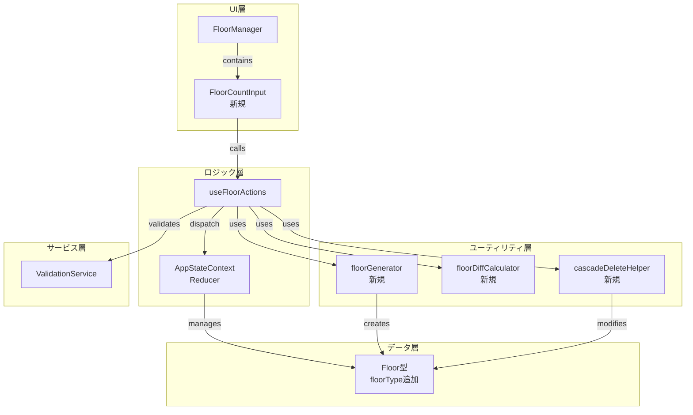
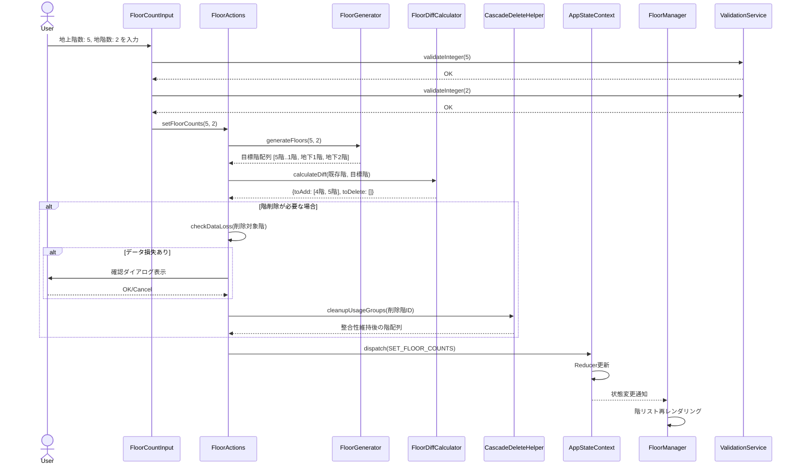
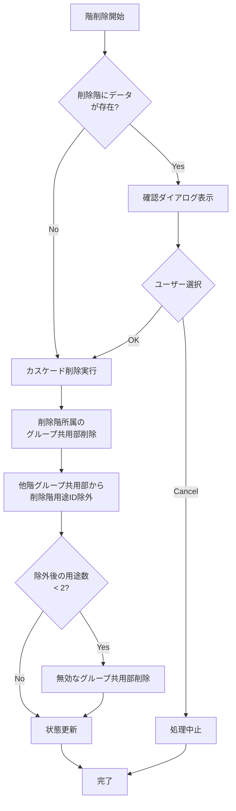
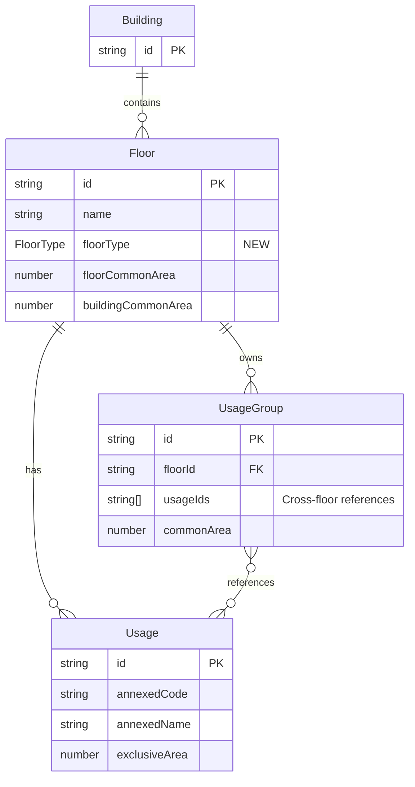

# 技術設計書: floor-count-input

## Overview

**Purpose**: この機能は、建物の階構成を効率的に定義できる階数入力方式を提供することで、大規模建物でのデータ入力作業を大幅に削減する。現在の順次追加方式から、地上階数・地階数の数値入力による一括生成方式へ移行する。

**Users**: 建物管理者および消防法面積計算を行うユーザーは、地上階数と地階数を入力するだけで、必要な全ての階情報が自動生成される直感的なワークフローを利用できる。

**Impact**: 既存の階管理UIを変更し、「階を追加」「削除」ボタンを階数入力フィールドに置き換える。階データの自動生成・差分検出・カスケード削除ロジックを導入し、既存の階編集機能（階名、共用部面積、用途管理）は引き続き利用可能。

### Goals

- 地上階数・地階数の数値入力により階データを一括生成する
- 階数変更時の差分検出により、既存データを保持しつつ不足階を追加・余剰階を削除する
- 階削除時のグループ共用部の整合性を自動維持する（カスケード削除）
- 地上階・地階を論理的な順序（降順）で表示する
- 既存の階編集機能との完全な互換性を維持する

### Non-Goals

- 階の表示順序のユーザーカスタマイズ（将来の拡張として検討）
- 中間階（メザニン階）のサポート（現在は地上階・地階のみ）
- 階データのインポート/エクスポート機能
- 100階を超える大規模建物での仮想スクロール最適化（初期実装ではパフォーマンステストのみ実施）

## Architecture

### Existing Architecture Analysis

**現在のアーキテクチャパターン**:
- **状態管理**: React Context API + useReducer による単一状態ツリー
- **アクションパターン**: `useXxxActions`フックでドメイン別にアクションを分離
- **不変更新**: Reducerによる既存データの自動保持
- **コンポーネント構成**: UI層（components） → ロジック層（contexts） → サービス層（services）

**保持すべき既存パターン**:
- Context + useReducer アーキテクチャ（AppStateContext）
- `useFloorActions`フックでのアクション提供
- ValidationServiceによるバリデーション
- Vitest + React Testing Library テストパターン

**統合ポイント**:
- `AppStateContext.tsx` - 新規アクション型`SET_FLOOR_COUNTS`を追加
- `FloorActions.tsx` - `setFloorCounts`関数を追加
- `FloorManager.tsx` - FloorCountInputコンポーネントを組み込み

**技術的制約**:
- 最低1階の維持制約（既存ビジネスルール）
- UsageGroupの跨階参照（floorId、usageIds）による依存関係
- React 19.2、TypeScript 5.9 の型安全性要件

### Architecture Pattern & Boundary Map



**Architecture Integration**:
- **選択パターン**: Utility-First Extension Pattern - 既存のContext + useReducerアーキテクチャを保持しつつ、新規ビジネスロジックをユーティリティ関数に分離
- **ドメイン境界**: 
  - **UI境界**: FloorCountInput（階数入力） / FloorManager（階リスト表示・編集）
  - **ロジック境界**: FloorActions（階操作の統合） / Utilities（純粋なビジネスロジック）
  - **データ境界**: Floor型の拡張（floorType追加）
- **既存パターン保持**: Context + useReducer、useXxxActionsフック、ValidationService
- **新規コンポーネント理由**: 
  - FloorCountInput - 階数入力UIの責務分離
  - ユーティリティ関数群 - テスト容易性と再利用性のため
- **Steering準拠**: 既存のReactアーキテクチャパターンを尊重、型安全性を維持

### Technology Stack

| Layer | Choice / Version | Role in Feature | Notes |
|-------|------------------|-----------------|-------|
| Frontend | React 19.2 | UIコンポーネントレンダリング | 既存スタック、Contextベース状態管理 |
| Language | TypeScript 5.9 | 型安全なコード実装 | 厳格な型チェック、判別可能ユニオン活用 |
| State Management | React Context + useReducer | グローバル状態管理 | 既存パターン、AppStateContext拡張 |
| Validation | ValidationService (拡張) | 入力値検証 | `validateInteger`メソッド追加 |
| Testing | Vitest 4.0 + React Testing Library 16.3 | 単体・統合テスト | 既存テスト環境、jsdom使用 |
| Build | Vite 7.2 | 開発サーバー・ビルド | 既存ビルドツール |

## System Flows

### 階数入力から階データ生成までのフロー



**Key Decisions**:
- バリデーションは入力時に即座に実行（早期フィードバック）
- 差分検出により既存データを保持（不要な再生成を回避）
- カスケード削除は階削除前に実行（整合性保証）
- 確認ダイアログはデータ損失がある場合のみ表示（UX最適化）

### 階削除時のカスケード処理フロー



## Requirements Traceability

| Requirement | Summary | Components | Interfaces | Flows |
|-------------|---------|------------|------------|-------|
| 1.1, 1.2 | 地上階数・地階数入力UI | FloorCountInput | FloorCountInputProps, validateInteger | 階数入力フロー |
| 1.3, 1.4, 1.5 | 整数バリデーション | ValidationService | validateInteger | 階数入力フロー |
| 1.6 | アクセシビリティ | FloorCountInput | ARIA属性 | - |
| 2.1, 2.2, 2.3, 2.4 | 階データ自動生成 | floorGenerator | generateFloors | 階数入力フロー |
| 2.5, 2.6, 2.7 | 差分検出と一括更新 | floorDiffCalculator | calculateFloorDiff | 階数入力フロー |
| 3.1, 3.2, 3.3, 3.4 | 階命名規則 | floorGenerator | generateFloors | 階数入力フロー |
| 4.1, 4.2, 4.3 | 既存データ保持 | floorDiffCalculator | calculateFloorDiff | 階数入力フロー |
| 4.4, 4.5, 4.6 | カスケード削除 | cascadeDeleteHelper | cleanupUsageGroupsAfterFloorDeletion | カスケード処理フロー |
| 5.1, 5.2, 5.3, 5.4 | 階順序管理 | FloorManager | sortFloors | - |
| 6.1, 6.2, 6.3, 6.4 | 状態同期 | FloorManager, useFloorActions | deriveFloorCounts | 階数入力フロー |
| 7.1, 7.2, 7.3, 7.4, 7.5 | 既存機能互換性 | FloorManager | - | - |
| 8.1 | 最大値制限エラー | ValidationService | validateInteger | 階数入力フロー |
| 8.2, 8.3, 8.4, 8.5 | 確認ダイアログ | useFloorActions | setFloorCounts | カスケード処理フロー |
| 9.1, 9.2, 9.3, 9.4, 9.5 | アクセシビリティ | FloorCountInput | ARIA属性 | - |
| 10.1, 10.2, 10.3, 10.4 | UI変更 | FloorManager | - | - |

## Components and Interfaces

| Component | Domain/Layer | Intent | Req Coverage | Key Dependencies (P0/P1) | Contracts |
|-----------|--------------|--------|--------------|--------------------------|-----------|
| FloorCountInput | UI | 地上階数・地階数の数値入力UI | 1.1-1.6, 9.1-9.5 | ValidationService (P0) | State |
| FloorManager (拡張) | UI | 階リスト表示、階数入力組み込み | 5.1-5.4, 7.1-7.5, 10.1-10.3 | FloorCountInput (P0), useFloorActions (P0) | State |
| useFloorActions (拡張) | Logic | 階操作アクション提供 | 2.5-2.7, 6.1-6.4, 8.2-8.5 | floorGenerator (P0), floorDiffCalculator (P0), cascadeDeleteHelper (P0) | Service |
| floorGenerator | Utility | 階配列生成と命名 | 2.1-2.4, 3.1-3.4 | generateUUID (P0) | Service |
| floorDiffCalculator | Utility | 差分検出と既存データ保持 | 2.5-2.7, 4.1-4.3 | - | Service |
| cascadeDeleteHelper | Utility | グループ共用部整合性維持 | 4.4-4.6 | - | Service |
| ValidationService (拡張) | Service | 入力値検証 | 1.3-1.5, 8.1 | - | Service |
| Floor (型拡張) | Data | 階データモデル | 3.3, 5.1-5.3 | - | - |

### UI層

#### FloorCountInput

| Field | Detail |
|-------|--------|
| Intent | 地上階数・地階数の数値入力UIを提供し、リアルタイムバリデーションを実行する |
| Requirements | 1.1, 1.2, 1.3, 1.4, 1.5, 1.6, 9.1, 9.2, 9.3, 9.4, 9.5 |

**Responsibilities & Constraints**
- 地上階数・地階数の数値入力フィールドを表示
- 入力値の整数バリデーション（0以上）を即座に実行
- バリデーションエラーをaria-live領域で通知
- 入力値変更時に親コンポーネントへコールバック
- データ境界: UIステートのみ（ローカル入力値）

**Dependencies**
- Outbound: ValidationService - 整数バリデーション (P0)
- Outbound: useFloorActions - 階数変更アクション実行 (P0)

**Contracts**: State [x]

##### State Management

```typescript
interface FloorCountInputProps {
  aboveGroundCount: number;
  basementCount: number;
  onChange: (aboveGround: number, basement: number) => void;
  disabled?: boolean;
}

interface FloorCountInputState {
  aboveGroundInput: string;
  basementInput: string;
  errors: {
    aboveGround?: string;
    basement?: string;
  };
}
```

- **State model**: ローカルステート（入力値、エラーメッセージ）
- **Persistence**: なし（制御されたコンポーネント）
- **Concurrency**: N/A

**Implementation Notes**
- **Integration**: FloorManagerの子コンポーネントとして配置、onChange経由で階数変更を通知
- **Validation**: 入力時にvalidateIntegerを実行、エラーメッセージを即座に表示
- **Risks**: 大規模建物（100階以上）での入力時のパフォーマンス（パフォーマンステストで検証）

#### FloorManager (拡張)

| Field | Detail |
|-------|--------|
| Intent | 階リストの表示、階数入力UI組み込み、従来の追加/削除ボタン削除 |
| Requirements | 5.1, 5.2, 5.3, 5.4, 6.3, 6.4, 7.1, 7.2, 7.3, 7.4, 7.5, 10.1, 10.2, 10.3 |

**Responsibilities & Constraints**
- FloorCountInputコンポーネントを組み込み
- 階データから地上階数・地階数を逆算して表示
- 階リストを論理的順序（地上階降順 → 地階降順）でソート・表示
- 既存の階名編集、共用部面積入力機能を保持
- 「階を追加」「削除」ボタンを削除
- データ境界: 階リストの表示とソート（状態更新はuseFloorActions経由）

**Dependencies**
- Inbound: AppStateContext - 階データの購読 (P0)
- Outbound: FloorCountInput - 階数入力UI (P0)
- Outbound: useFloorActions - 階数変更、階名更新アクション (P0)

**Contracts**: State [x]

##### State Management

```typescript
// 既存のFloorManagerに追加される機能
function deriveFloorCounts(floors: Floor[]): { aboveGround: number; basement: number } {
  const aboveGround = floors.filter(f => f.floorType === 'above-ground').length;
  const basement = floors.filter(f => f.floorType === 'basement').length;
  return { aboveGround, basement };
}

function sortFloors(floors: Floor[]): Floor[] {
  const aboveGround = floors
    .filter(f => f.floorType === 'above-ground')
    .sort((a, b) => extractFloorNumber(b.name) - extractFloorNumber(a.name)); // 降順
  
  const basement = floors
    .filter(f => f.floorType === 'basement')
    .sort((a, b) => extractFloorNumber(a.name) - extractFloorNumber(b.name)); // 降順（地下1階が先）
  
  return [...aboveGround, ...basement];
}
```

**Implementation Notes**
- **Integration**: FloorCountInputのonChangeでsetFloorCountsを呼び出し、階データ更新を統合
- **Validation**: ソート時のfloorType検証（型安全性により保証）
- **Risks**: extractFloorNumber関数の階名パースロジックが複雑化する可能性（正規表現によるパターンマッチング）

### ロジック層

#### useFloorActions (拡張)

| Field | Detail |
|-------|--------|
| Intent | 階数変更アクションを統合し、差分検出・カスケード削除を実行する |
| Requirements | 2.5, 2.6, 2.7, 6.1, 6.2, 8.2, 8.3, 8.4 |

**Responsibilities & Constraints**
- 地上階数・地階数から目標階配列を生成
- 現在の階データと目標階配列の差分を検出
- 階削除時のデータ損失を検出し、確認ダイアログを表示
- カスケード削除を実行し、グループ共用部の整合性を維持
- SET_FLOOR_COUNTSアクションをディスパッチ
- トランザクション境界: 階数変更操作全体（差分検出 → カスケード削除 → 状態更新）

**Dependencies**
- Inbound: FloorCountInput - setFloorCounts呼び出し (P0)
- Outbound: floorGenerator - 階配列生成 (P0)
- Outbound: floorDiffCalculator - 差分検出 (P0)
- Outbound: cascadeDeleteHelper - カスケード削除 (P0)
- Outbound: AppStateContext - 状態更新ディスパッチ (P0)

**Contracts**: Service [x]

##### Service Interface

```typescript
interface FloorActionsExtension {
  /**
   * 地上階数・地階数を設定し、階データを一括更新する
   * @param aboveGroundCount - 地上階数（0以上の整数）
   * @param basementCount - 地階数（0以上の整数）
   * @returns 成功時は更新後の階配列、失敗時はエラー
   */
  setFloorCounts(
    aboveGroundCount: number,
    basementCount: number
  ): Promise<Result<Floor[], ValidationError>>;
}
```

- **Preconditions**: 
  - aboveGroundCount >= 0 かつ basementCount >= 0
  - aboveGroundCount + basementCount >= 1（最低1階制約）
- **Postconditions**: 
  - 階配列が目標階数と一致
  - 既存階のデータが保持される（差分検出により）
  - グループ共用部の整合性が維持される（カスケード削除により）
- **Invariants**: 
  - 階配列の要素数 === aboveGroundCount + basementCount
  - 全階にfloorTypeが設定されている
  - グループ共用部の用途数 >= 2（または削除済み）

**Implementation Notes**
- **Integration**: floorGenerator → floorDiffCalculator → cascadeDeleteHelper の順に実行
- **Validation**: 最低1階制約をチェック、データ損失検出はusageデータ・共用部面積・グループ共用部の有無で判定
- **Risks**: 確認ダイアログでのキャンセル処理、非同期処理の競合状態（useCallbackでメモ化）

### ユーティリティ層

#### floorGenerator

| Field | Detail |
|-------|--------|
| Intent | 地上階数・地階数から階配列を生成し、適切な階名を設定する |
| Requirements | 2.1, 2.2, 2.3, 2.4, 3.1, 3.2, 3.3, 3.4 |

**Responsibilities & Constraints**
- 地上階数から地上階配列を生成（"1階", "2階", ...）
- 地階数から地階配列を生成（"地下1階", "地下2階", ...）
- 各階に一意のIDを割り当て（generateUUID使用）
- 階タイプ（floorType）を設定
- データ境界: 階配列の生成のみ（状態管理との依存なし）

**Dependencies**
- Outbound: generateUUID - UUID生成 (P0)

**Contracts**: Service [x]

##### Service Interface

```typescript
/**
 * 地上階数・地階数から階配列を生成する
 * @param aboveGroundCount - 地上階数（0以上）
 * @param basementCount - 地階数（0以上）
 * @returns 生成された階配列（地上階 + 地階）
 */
function generateFloors(
  aboveGroundCount: number,
  basementCount: number
): Floor[] {
  const aboveGroundFloors: Floor[] = [];
  const basementFloors: Floor[] = [];
  
  // 地上階生成（1階, 2階, ...）
  for (let i = 1; i <= aboveGroundCount; i++) {
    aboveGroundFloors.push({
      id: generateUUID(),
      name: `${i}階`,
      floorType: 'above-ground',
      floorCommonArea: 0,
      buildingCommonArea: 0,
      usages: [],
      usageGroups: [],
    });
  }
  
  // 地階生成（地下1階, 地下2階, ...）
  for (let i = 1; i <= basementCount; i++) {
    basementFloors.push({
      id: generateUUID(),
      name: `地下${i}階`,
      floorType: 'basement',
      floorCommonArea: 0,
      buildingCommonArea: 0,
      usages: [],
      usageGroups: [],
    });
  }
  
  return [...aboveGroundFloors, ...basementFloors];
}
```

- **Preconditions**: aboveGroundCount >= 0 かつ basementCount >= 0
- **Postconditions**: 返却配列の長さ === aboveGroundCount + basementCount
- **Invariants**: 各階に一意のID、floorTypeが設定されている

**Implementation Notes**
- **Integration**: 純粋関数として実装、useFloorActionsから呼び出し
- **Validation**: 入力パラメータは呼び出し側で検証済み
- **Risks**: なし（シンプルなループ処理）

#### floorDiffCalculator

| Field | Detail |
|-------|--------|
| Intent | 現在の階配列と目標階配列の差分を検出し、既存データを保持する |
| Requirements | 2.5, 2.6, 2.7, 4.1, 4.2, 4.3 |

**Responsibilities & Constraints**
- 現在の階配列と目標階配列を比較
- 階名とfloorTypeで一致判定（IDは変更されない）
- 追加が必要な階と削除が必要な階を特定
- 既存階のデータ（usages、共用部面積、usageGroups）を保持
- データ境界: 差分検出のみ（状態更新との依存なし）

**Dependencies**
- なし（純粋関数）

**Contracts**: Service [x]

##### Service Interface

```typescript
interface FloorDiff {
  /** 既存データを保持した階配列（既存階 + 新規階） */
  mergedFloors: Floor[];
  /** 削除が必要な階のID配列 */
  floorsToDelete: string[];
}

/**
 * 現在の階配列と目標階配列の差分を検出する
 * @param currentFloors - 現在の階配列
 * @param targetFloors - 目標階配列（generateFloorsで生成）
 * @returns 差分情報（マージ後の階配列、削除対象階ID）
 */
function calculateFloorDiff(
  currentFloors: Floor[],
  targetFloors: Floor[]
): FloorDiff {
  const merged: Floor[] = [];
  const deleteIds: string[] = [];
  
  // 目標階ごとに既存階を探索
  for (const target of targetFloors) {
    const existing = currentFloors.find(
      f => f.name === target.name && f.floorType === target.floorType
    );
    
    if (existing) {
      // 既存階を保持（データそのまま）
      merged.push(existing);
    } else {
      // 新規階を追加
      merged.push(target);
    }
  }
  
  // 削除対象階を特定
  for (const current of currentFloors) {
    const stillExists = targetFloors.some(
      t => t.name === current.name && t.floorType === current.floorType
    );
    if (!stillExists) {
      deleteIds.push(current.id);
    }
  }
  
  return { mergedFloors: merged, floorsToDelete: deleteIds };
}
```

- **Preconditions**: currentFloors、targetFloorsが有効な配列
- **Postconditions**: 
  - mergedFloors.length === targetFloors.length
  - 既存階のデータが保持される
  - floorsToDeleteに削除対象階IDが含まれる
- **Invariants**: 階名 + floorTypeの組み合わせで一意性が保証される

**Implementation Notes**
- **Integration**: useFloorActionsで呼び出し、結果を基にカスケード削除を実行
- **Validation**: 階名の一致判定（厳格な文字列比較）
- **Risks**: 階名変更時の既存データ保持ロジック（階名変更は別機能で対応）

#### cascadeDeleteHelper

| Field | Detail |
|-------|--------|
| Intent | 階削除時のグループ共用部の整合性を維持する |
| Requirements | 4.4, 4.5, 4.6 |

**Responsibilities & Constraints**
- 削除階に所属するグループ共用部を削除
- 他階のグループ共用部から削除階の用途IDを除外
- 除外後の用途数が2未満のグループ共用部を削除（二次削除）
- データ境界: グループ共用部の整合性維持（階配列の変更）

**Dependencies**
- なし（純粋関数）

**Contracts**: Service [x]

##### Service Interface

```typescript
/**
 * 階削除時のグループ共用部のクリーンアップ
 * @param floors - 階配列
 * @param deleteFloorIds - 削除する階のID配列
 * @returns 整合性維持後の階配列
 */
function cleanupUsageGroupsAfterFloorDeletion(
  floors: Floor[],
  deleteFloorIds: string[]
): Floor[] {
  // 削除階の用途IDを収集
  const deleteUsageIds = new Set<string>();
  floors.forEach(floor => {
    if (deleteFloorIds.includes(floor.id)) {
      floor.usages.forEach(usage => deleteUsageIds.add(usage.id));
    }
  });
  
  return floors.map(floor => {
    // 削除階に所属するグループ共用部を削除
    if (deleteFloorIds.includes(floor.id)) {
      return { ...floor, usageGroups: [] };
    }
    
    // 他階のグループ共用部から削除階の用途IDを除外
    const cleanedGroups = floor.usageGroups
      .map(group => ({
        ...group,
        usageIds: group.usageIds.filter(id => !deleteUsageIds.has(id)),
      }))
      .filter(group => group.usageIds.length >= 2); // 用途数2未満を削除
    
    return { ...floor, usageGroups: cleanedGroups };
  });
}
```

- **Preconditions**: floors配列とdeleteFloorIdsが有効
- **Postconditions**: 
  - 削除階のグループ共用部が空配列
  - 他階のグループ共用部に削除階の用途IDが含まれない
  - 全グループ共用部の用途数 >= 2
- **Invariants**: グループ共用部の用途数制約（2以上）が維持される

**Implementation Notes**
- **Integration**: useFloorActionsで階削除前に実行
- **Validation**: 用途数検証（filter条件）
- **Risks**: 循環参照の可能性（エッジケーステストで検証）

### サービス層

#### ValidationService (拡張)

| Field | Detail |
|-------|--------|
| Intent | 整数バリデーションロジックを追加 |
| Requirements | 1.3, 1.4, 1.5, 8.1 |

**Responsibilities & Constraints**
- 整数値検証（0以上、小数不可）
- 最大値制限検証（実装では1000階を上限とする）
- エラーメッセージの生成
- データ境界: バリデーションロジックのみ

**Dependencies**
- なし

**Contracts**: Service [x]

##### Service Interface

```typescript
class ValidationService {
  /**
   * 整数値のバリデーション
   * @param value - 検証する値
   * @param fieldName - フィールド名（エラーメッセージ用）
   * @param max - 最大値（オプション）
   * @returns バリデーション結果
   */
  validateInteger(
    value: number,
    fieldName: string,
    max: number = 1000
  ): Result<void, ValidationError> {
    // 有限数チェック
    if (!Number.isFinite(value)) {
      return {
        success: false,
        error: {
          type: 'INVALID_NUMBER',
          field: fieldName,
          message: `${fieldName}は有効な数値である必要があります`,
        },
      };
    }
    
    // 整数チェック
    if (!Number.isInteger(value)) {
      return {
        success: false,
        error: {
          type: 'INVALID_NUMBER',
          field: fieldName,
          message: `${fieldName}は整数である必要があります（小数は使用できません）`,
        },
      };
    }
    
    // 負の数チェック
    if (value < 0) {
      return {
        success: false,
        error: {
          type: 'NEGATIVE_VALUE',
          field: fieldName,
          message: `${fieldName}は0以上である必要があります`,
        },
      };
    }
    
    // 最大値チェック
    if (value > max) {
      return {
        success: false,
        error: {
          type: 'INVALID_NUMBER',
          field: fieldName,
          message: `${fieldName}は${max}以下である必要があります`,
        },
      };
    }
    
    return { success: true, value: undefined };
  }
}
```

- **Preconditions**: valueが数値型
- **Postconditions**: 成功時はResult<void>、失敗時はValidationError
- **Invariants**: エラーメッセージは日本語

**Implementation Notes**
- **Integration**: FloorCountInputで入力時に呼び出し
- **Validation**: Number.isInteger、Number.isFiniteを使用
- **Risks**: なし（標準的なバリデーション）

## Data Models

### Domain Model



**Key Changes**:
- Floor型に`floorType: 'above-ground' | 'basement'`フィールドを追加
- UsageGroupの`usageIds`は跨階参照可能（カスケード削除の複雑性の原因）

**Business Rules & Invariants**:
- 建物は最低1階を持つ
- グループ共用部の用途数は2以上（全用途未満）
- 階名 + floorTypeの組み合わせで一意性を持つ

### Logical Data Model

**Structure Definition**:

```typescript
// Floor型の拡張
interface Floor {
  id: string; // UUID
  name: string; // 階名称（"1階", "2階", "地下1階", ...）
  floorType: 'above-ground' | 'basement'; // 新規フィールド
  floorCommonArea: number; // 階の共用部面積
  buildingCommonArea: number; // 建物全体の共用部面積
  usages: Usage[]; // 用途データ
  usageGroups: UsageGroup[]; // グループ共用部
}

// 既存のUsageGroup型（参考）
interface UsageGroup {
  id: string;
  floorId: string; // 所属階のID
  usageIds: string[]; // 参照用途のID（跨階可能）
  commonArea: number;
}
```

**Consistency & Integrity**:
- **Transaction boundaries**: 階数変更操作全体（差分検出 → カスケード削除 → 状態更新）
- **Cascading rules**: 
  - 階削除時、所属するグループ共用部を削除
  - 階削除時、他階のグループ共用部から該当用途IDを除外
  - 用途ID除外後、用途数が2未満のグループ共用部を削除
- **Temporal aspects**: なし（履歴管理なし）

**既存データの移行**:
- 既存のFloor型には`floorType`フィールドが存在しない
- 移行戦略: 階名から階タイプを推測（"地下"を含む場合は'basement'、それ以外は'above-ground'）
- デフォルト値: 'above-ground'

```typescript
/**
 * 既存の階データにfloorTypeを設定する移行ヘルパー
 */
function migrateFloorType(floor: Floor): Floor {
  if (floor.floorType !== undefined) {
    return floor; // 既に設定済み
  }
  
  const floorType = floor.name.includes('地下') ? 'basement' : 'above-ground';
  return { ...floor, floorType };
}
```

### Data Contracts & Integration

**State Management Data Flow**:

```typescript
// AppStateContext.tsxに追加されるアクション型
type AppAction = 
  | ... // 既存のアクション型
  | { 
      type: 'SET_FLOOR_COUNTS'; 
      payload: { 
        floors: Floor[]; 
        deletedFloorIds: string[]; 
      } 
    };

// Reducerの実装
function appStateReducer(state: AppState, action: AppAction): AppState {
  switch (action.type) {
    // ... 既存のケース
    
    case 'SET_FLOOR_COUNTS': {
      const { floors, deletedFloorIds } = action.payload;
      return {
        ...state,
        building: {
          ...state.building,
          floors: floors,
        },
      };
    }
  }
}
```

**Schema Versioning**:
- Floor型のfloorTypeフィールド追加はバックワード互換性を持つ（オプショナルとして扱い、デフォルト値を設定）
- 将来的なスキーマ変更に備え、型定義にバージョン管理を導入することを検討

## Error Handling

### Error Strategy

**User Errors (4xx)**:
- **無効な入力（負の数、小数）**: フィールドレベルバリデーションでリアルタイムにエラー表示
- **最大値超過（1000階以上）**: バリデーションエラーメッセージで制限値を明示
- **最低1階制約違反（地上階0・地階0）**: バリデーションエラーで「最低1階が必要です」と表示

**Business Logic Errors (422)**:
- **データ損失警告**: 階削除時にデータが存在する場合、確認ダイアログで「削除すると〇階のデータが失われます。続行しますか？」と表示
- **グループ共用部の整合性エラー**: カスケード削除ロジックで自動解決（ユーザーへの通知は不要）

**System Errors (5xx)**:
- **状態更新失敗**: try-catchでキャッチし、エラーメッセージをコンソールに出力（開発時のデバッグ用）

### Error Categories and Responses

| エラーカテゴリ | 検出タイミング | ユーザーフィードバック | 復旧方法 |
|--------------|--------------|---------------------|---------|
| 無効な入力（負の数、小数） | 入力時（onChange） | フィールド下にエラーメッセージ表示 | 正しい値を入力 |
| 最大値超過 | 入力時（onChange） | 「1000階以下である必要があります」 | 制限内の値を入力 |
| 最低1階制約違反 | setFloorCounts実行時 | 「最低1階が必要です」 | 地上階または地階を1以上に設定 |
| データ損失警告 | 階削除検出時 | 確認ダイアログ（OK/Cancel） | キャンセルで中止、OKで続行 |
| 状態更新失敗 | Reducer実行時 | コンソールエラー | リロードまたはバグレポート |

### Monitoring

**Error Tracking**:
- バリデーションエラーはローカルステートで管理（ErrorBoundary不要）
- 状態更新エラーはconsole.errorで記録（本番環境では外部ロギングサービスへ送信を検討）

**Logging**:
- 開発環境: すべてのバリデーションエラーをコンソールに出力
- 本番環境: システムエラーのみをロギング（ユーザー入力エラーは除外）

## Testing Strategy

### Unit Tests

**FloorCountInput**:
1. 地上階数・地階数の入力値が正しくステートに反映される
2. 無効な値（負の数、小数）入力時にバリデーションエラーが表示される
3. 最大値超過時にエラーメッセージが表示される
4. ARIA属性が正しく設定されている（aria-label、aria-live）
5. キーボード操作で全機能が利用可能

**floorGenerator**:
1. 地上階数5、地階数2で7階分の配列が生成される
2. 地上階の階名が"1階", "2階", ..., "5階"となる
3. 地階の階名が"地下1階", "地下2階"となる
4. 全階にfloorType（'above-ground' | 'basement'）が設定される
5. 各階に一意のIDが割り当てられる

**floorDiffCalculator**:
1. 既存階と同じ階名・タイプの階は既存データを保持する
2. 新規階は新しいIDで生成される
3. 削除対象階のIDがfloorsToDeleteに含まれる
4. 階数増加時に不足階のみが追加される
5. 階数減少時に余剰階のみが削除される

**cascadeDeleteHelper**:
1. 削除階に所属するグループ共用部が削除される
2. 他階のグループ共用部から削除階の用途IDが除外される
3. 除外後の用途数が2未満のグループ共用部が削除される
4. 削除階以外のグループ共用部は影響を受けない
5. エッジケース: 全階削除、循環参照、用途ID重複

**ValidationService.validateInteger**:
1. 正の整数がバリデーション成功
2. 0がバリデーション成功
3. 負の数がバリデーション失敗
4. 小数がバリデーション失敗
5. 最大値超過がバリデーション失敗

### Integration Tests

**FloorManager + FloorCountInput統合**:
1. 地上階数5、地階数2入力で7階が表示される
2. 階数変更で階リストが更新される
3. 階削除時に確認ダイアログが表示される（データ存在時のみ）
4. 階順序が論理的（地上階降順 → 地階降順）に表示される
5. 既存階の階名編集が引き続き動作する

**useFloorActions + Utilities統合**:
1. setFloorCounts実行で差分検出 → カスケード削除 → 状態更新が連携動作
2. 階削除時にグループ共用部の整合性が維持される
3. 階増加時に既存データが保持される
4. 最低1階制約が維持される
5. 非同期処理の競合状態が発生しない

### E2E/UI Tests

**階数入力から階リスト更新までの完全フロー**:
1. ユーザーが地上階数5、地階数2を入力
2. 階リストに7階が論理的順序で表示される
3. 地上階数を3に変更すると4階・5階が削除される
4. 削除される階にデータがある場合、確認ダイアログが表示される
5. キャンセルで変更が中止され、OKで階が削除される

**アクセシビリティテスト**:
1. スクリーンリーダーで階数入力フィールドが正しく読み上げられる
2. キーボードのみで全操作が可能
3. フォーカス順序が論理的
4. バリデーションエラーがaria-live領域で通知される

### Performance/Load Tests

**大規模建物での階数変更**:
1. 100階の建物で階数変更時の処理時間を測定（< 1秒目標）
2. 階数入力時のレンダリングパフォーマンス（60fps維持）
3. カスケード削除の処理時間（大量のグループ共用部が存在する場合）
4. メモリ使用量の測定（メモリリークチェック）

## Optional Sections

### Performance & Scalability

**Target Metrics**:
- 階数入力からUI更新まで: < 1秒（100階未満）
- レンダリングフレームレート: 60fps維持
- メモリ使用量: 初期状態 + 10MB以内（100階の場合）

**Scaling Approaches**:
- **現在**: 全階を一度にレンダリング（100階未満で十分なパフォーマンス）
- **将来**: 100階を超える場合は仮想スクロール（react-windowなど）の導入を検討

**Optimization Techniques**:
- `useMemo`でソート後の階配列をメモ化
- `useCallback`でイベントハンドラをメモ化（不要な再レンダリング防止）
- ユーティリティ関数は純粋関数として実装（テストとパフォーマンスの両立）

### Migration Strategy

**Phase 1: 型定義の拡張とユーティリティ実装（1-2日）**
- Floor型にfloorTypeフィールドを追加（オプショナル）
- floorGenerator、floorDiffCalculator、cascadeDeleteHelperを実装
- ValidationService.validateIntegerを追加
- 単体テストを実装

**Phase 2: UI実装と統合（2-3日）**
- FloorCountInputコンポーネントを実装
- FloorManagerにFloorCountInputを組み込み
- useFloorActionsにsetFloorCountsを追加
- 統合テストを実装

**Phase 3: 既存データの移行とクリーンアップ（1-2日）**
- 既存階データへのfloorType設定（migrateFloorType）
- 「階を追加」「削除」ボタンの削除
- E2Eテストを実装
- パフォーマンステストを実施

**Rollback Triggers**:
- E2Eテストでクリティカルなバグが検出された場合
- パフォーマンステストで1秒以上の遅延が発生した場合
- ユーザーフィードバックで重大なUX問題が報告された場合

**Validation Checkpoints**:
- Phase 1終了時: 全ユニットテストが合格
- Phase 2終了時: 全統合テストが合格
- Phase 3終了時: 全E2Eテストが合格、パフォーマンス目標達成
